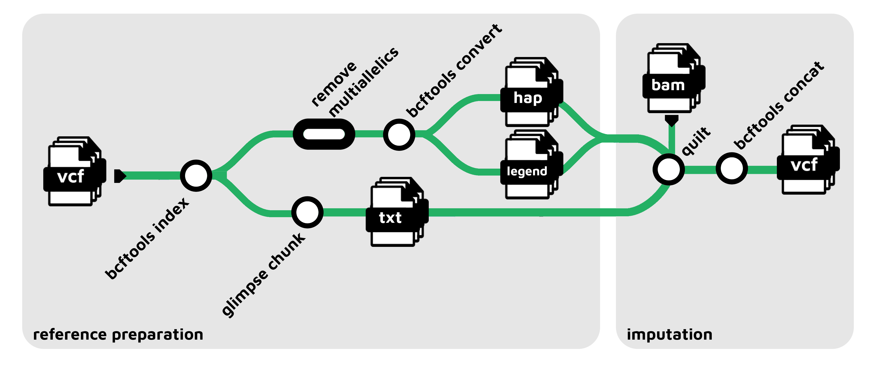

[](https://www.nextflow.io/)
[](https://docs.conda.io/en/latest/)
[](https://www.docker.com/)
[](https://sylabs.io/docs/)

## Introduction

**nf-core/quilt** is a bioinformatics pipeline, currently under development, that performs genetic imputation using the software ([`QUILT`](https://github.com/rwdavies/QUILT)). It was built using the nf-core template but it is not currently part of nf-core.

# 


1. Read a samplesheet containing BAM files from your samples.
2. Read a samplesheet with VCFs from a haplotype reference panel.
3. Create chunks from reference panel using ([`GLIMPSE_CHUNK`](https://github.com/odelaneau/GLIMPSE)) v1.
4. Remove multiallelics from reference panel using ([`BCFTOOLS`](https://samtools.github.io/bcftools/bcftools.html)).
5. Obtain reference legend and haplotype files using ([`BCFTOOLS`](https://samtools.github.io/bcftools/bcftools.html)).
6. Perform imputation using ([`QUILT`](https://github.com/rwdavies/QUILT)).


## Usage

:::note
If you are new to Nextflow and nf-core, please refer to [this page](https://nf-co.re/docs/usage/installation) on how
to set-up Nextflow. Make sure to [test your setup](https://nf-co.re/docs/usage/introduction#how-to-run-a-pipeline)
with `-profile test` before running the workflow on actual data.
:::


First, prepare a samplesheet with your input data that looks as follows:

`samplesheet.csv`:

```csv
sample,bam,bai
SAMPLE_BAM,sample.recal.bam,sample.recal.bai
```

Each row represents a sample with its BAM and BAI files. You can obtain these input files using other nf-core pipelines, such as [nf-core/sarek](https://github.com/nf-core/sarek).


Then, prepare a samplesheet with your reference data that looks as follows:

`samplesheet_reference.csv`:

```csv
chr,vcf
11,reference_chr11.vcf.gz
8,reference_chr8.vcf.gz
```

Each row represents a chromosome with its corresponding VCF file, containing information about the reference haplotype panel. You can obtain reference panels from publicly available sources such as the [1000 Genomes Project phase 3](https://www.internationalgenome.org/home).


Now, you can run the pipeline using:


```bash
nextflow run nf-core/quilt \
   -profile <docker/singularity/.../institute> \
   --input samplesheet.csv \
   --reference samplesheet_reference.csv \
   --outdir <OUTDIR>
```

:::warning
Please provide pipeline parameters via the CLI or Nextflow `-params-file` option. Custom config files including those
provided by the `-c` Nextflow option can be used to provide any configuration _**except for parameters**_;
see [docs](https://nf-co.re/usage/configuration#custom-configuration-files).
:::

For more details and further functionality, please refer to the [usage documentation](https://nf-co.re/quilt/usage) and the [parameter documentation](https://nf-co.re/quilt/parameters).

## Pipeline output

For more details about the output files and reports, please refer to the
[output documentation](https://nf-co.re/quilt/output).

## Credits

This nextflow pipeline based on the nf-core template was originally written by atrigila.

## Features to be developed

This pipeline currently has the minimum number of input files required for QUILT to run. Future improvements include:
- Use of additional optional files such as genetic map files, posfile and phasefile.
- Preparation of reference files separately from imputation.
- Use of pre-computed chunks and reference files.


## Contributions and Support

If you would like to contribute to this pipeline, please see the [contributing guidelines](.github/CONTRIBUTING.md).

## Citations

<!-- nf-core: Add citation for pipeline after first release. Uncomment lines below and update Zenodo doi and badge at the top of this file. -->
<!-- If you use  nf-core/quilt for your analysis, please cite it using the following doi: [10.5281/zenodo.XXXXXX](https://doi.org/10.5281/zenodo.XXXXXX) -->


An extensive list of references for the tools used by the pipeline can be found in the [`CITATIONS.md`](CITATIONS.md) file.

You can cite the main imputation method ([`QUILT`](https://github.com/rwdavies/QUILT)) as follows:

> **Rapid genotype imputation from sequence with reference panels.**
>
> Davies, R. W., Kucka, M., Su, D., Shi, S., Flanagan, M., Cunniff, C. M., Chan, Y. F., & Myers, S.
>
> _Nature genetics_ 2021 June 03. doi: [10.1038/s41588-021-00877-0](https://doi.org/10.1038/s41588-021-00877-0)


You can cite the `nf-core` publication as follows:

> **The nf-core framework for community-curated bioinformatics pipelines.**
>
> Philip Ewels, Alexander Peltzer, Sven Fillinger, Harshil Patel, Johannes Alneberg, Andreas Wilm, Maxime Ulysse Garcia, Paolo Di Tommaso & Sven Nahnsen.
>
> _Nat Biotechnol._ 2020 Feb 13. doi: [10.1038/s41587-020-0439-x](https://dx.doi.org/10.1038/s41587-020-0439-x).
